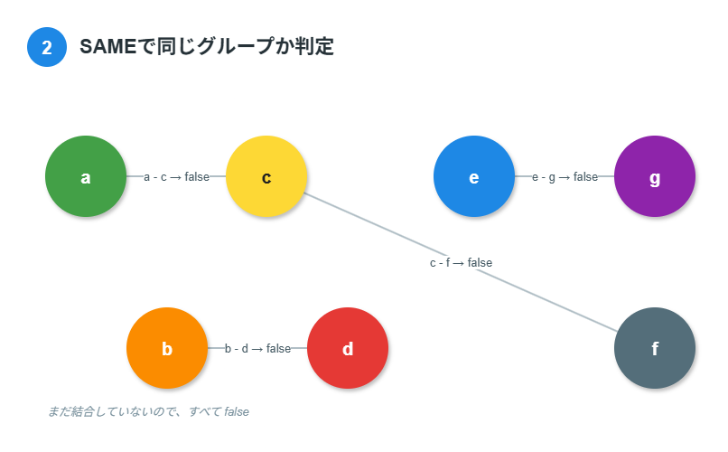
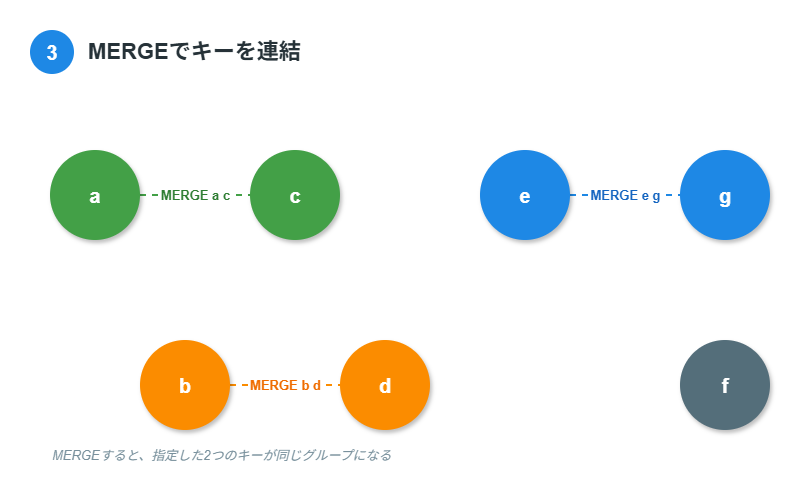
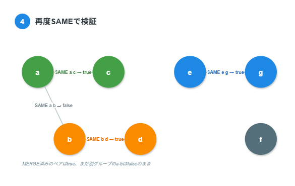
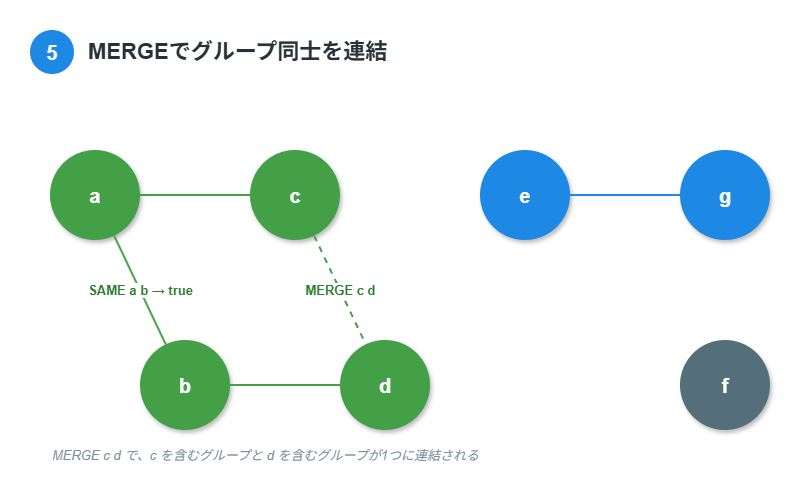
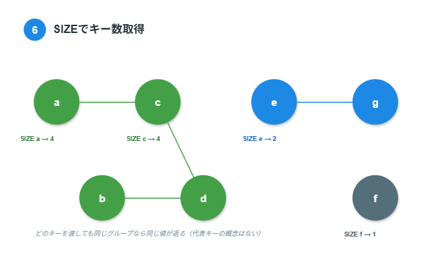
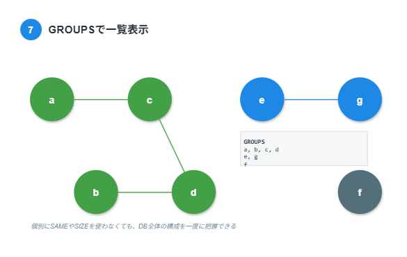
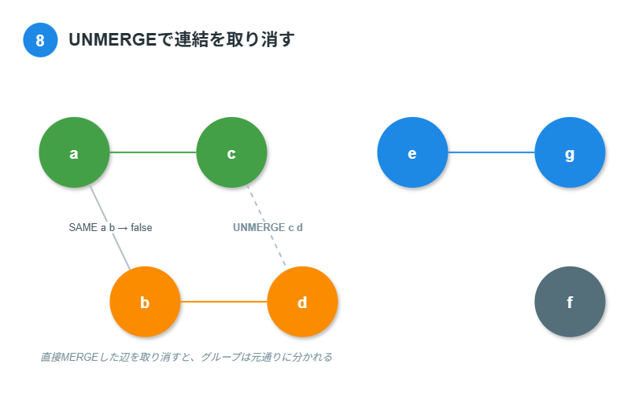

<p align="center">
  
  <picture>
    <source media="(prefers-color-scheme: dark)" srcset="./docs/images/wordmark-dark.svg">
    
  </picture>
</p>

### UFO

Union-Findをコアロジックにしたデータベース。

[ロードマップ](docs/ROADMAP.md) ・ [アーキテクチャ](docs/architecture.md) ・ [Union-Find概論](docs/union-find.md) ・ [GUIアプリ (UFO Studio)](https://github.com/kento-yoshidu/toy_ufdb_gui_app)

## バージョンについて

メジャーバージョンごとにリポジトリを分けており、このリポジトリはバージョン0にあたる。

メジャーバージョンごとの大まかな方針は以下の通り。

|メジャーバージョン|内容|
|---|---|
|0|コア機能。HTML出力機能。ストレージ実装。TCP接続対応。ユーザーアカウント。configファイル|
|1|未定（v0からさらに先の大きな方針転換が必要になった場合に検討）|

値なし（キーのみ管理）など、v0のスコープの詳細は [`docs/ROADMAP.md`](docs/ROADMAP.md) の「既知の制約」を参照。

内部実装・計算量は [`docs/architecture.md`](docs/architecture.md)、Union-Find自体の一般論は [`docs/union-find.md`](docs/union-find.md) を参照。

## できること

1. 最小単位である要素（以下、**キー**）を登録する
2. キー同士をつなげて**グループ**を作る。また、グループ同士をつなげることもできる
3. 任意の2つのキーが同じグループに属するかを判定する

以下、画像付きで機能を説明する。

7つのキー、`a` / `b` / `c` / `d` / `e` / `f` / `g`を追加した様子。キー単体でもグループとみなす。7つがそれぞれ別のグループに属している。


任意の2つのキーが同じグループに属しているかをtrue or falseで判定できる。今は全て別のグループに属しているため、どの組み合わせでもfalseが返る。



MERGEで2つのキーを連結してグループを作る。ここでは `a`-`c`、`b`-`d`、`e`-`g` をそれぞれMERGEし、3組が新しいグループになる（`f` は誰ともMERGEしていないため、単体のグループのまま）。未登録のキーを指定した場合は自動的に登録してから連結されるため、事前にINSERTしておく必要はない。



MERGE後に改めてSAMEで判定すると、`a`-`c`・`b`-`d`・`e`-`g`はそれぞれ同じグループになったためtrueが返る。一方`a`と`b`はまだ別グループ（`a`-`c`グループ、`b`-`d`グループ）に属しているため、SAMEはfalseのままとなる。



MERGEはキー単位で指定するが、そのキーがすでに他のキーとMERGE済みでグループを作っている場合は、グループ同士が連結される。ここでは `c`（`a`-`c`グループ）と `d`（`b`-`d`グループ）をMERGEし、`a`・`b`・`c`・`d` の4つのキーが1つのグループにまとまる。先ほどfalseだった`a`-`b`も、このMERGEによって間接的に同じグループへ入るためtrueに変わる。



SIZEでキーが属するグループの要素数を取得できる。グループには「親キー」「代表キー」といった特別な1つのキーという概念はないため、同じグループに属するどのキーを引数に渡しても同じ結果が返る（例: `a`と`c`はどちらも同じ`{a, b, c, d}`グループに属するため、`SIZE a`・`SIZE c`はどちらも4を返す）。



GROUPSで、現在存在する全てのグループの中身を一度に一覧表示できる。個別にSAMEやSIZEで確認しなくても、DB全体がどう分かれているかを俯瞰できる。



UNMERGEで、直接MERGEしたキーの連結を取り消せる。ここでは`c`-`d`間のMERGEを取り消し、`a`・`b`・`c`・`d`の1つのグループを再び`a`-`c`グループと`b`-`d`グループに分割する。`a`と`b`の間にはそもそも直接のMERGEが無いため、`UNMERGE a b`のように直接連結していないキーを指定しても何も起こらない。



## 使い方

`cargo run`で起動する。

SQLに相当する、このDBの命令文の呼び名を **UFQL**（Union-Find Query Language）とする。REPL上で1行ずつ入力する。

| コマンド | 役割 |
| --- | --- |
|`INSERT <key>`|新しいキーを1つ登録する |
|`MERGE <a> <b>`|キー`a`とキー`b` が属するグループを1つに統合する（未登録キーは自動で登録される） |
|`UNMERGE <a> <b>`|キー`a`とキー`b`を直接連結したMERGEを取り消す。`a`と`b`の間に直接MERGEした辺が無い場合は何も起こらない |
| `SAME <a> <b>` | `a` と `b` が同じグループに属するかを判定する。属するなら `true`、属しないなら `false` が返る |
|`GROUPS` | 代表元ごとにグループの中身をまとめて一覧表示する |
|`SIZE <key>`|キーが属するグループのサイズ（要素数）を表示する。未登録キーの場合はエラーメッセージを表示する |
|`CREATEDB <name>`|名前付きのDBを作成する。既に存在する名前を指定した場合は作成せず、そのDBに切り替えるだけになる。いずれの場合も実行後は`<name>`が選択中のDBになる |
|`USE <name>`|操作対象のDBを`<name>`に切り替える。存在しない名前を指定すると、作成するかどうかの確認（y/n）を挟む |

`INSERT`/`MERGE`/`SAME`/`GROUPS`/`SIZE`は、常に「現在`USE`で選択中の1つのDB」だけを操作対象にする。起動直後は`ufdb`という名前のデフォルトDBが選択された状態になっている（`CREATEDB`しなくてもすぐ使い始められる）。

`exit` / `quit` でREPLを終了する。

```bash
INSERT a
true
elapsed: 0.178900ms

INSERT b
true
elapsed: 0.124000ms

INSERT c
true
elapsed: 0.150000ms

INSERT d
true
elapsed: 0.141400ms

SAME a b
false
elapsed: 0.119500ms

MERGE a b
true
elapsed: 0.146400ms

SAME a b
true
elapsed: 0.134900ms

SAME a c
false
elapsed: 0.168800ms

MERGE c d
true
elapsed: 0.196500ms

SAME c d
true
elapsed: 0.166000ms

SAME a c
false
elapsed: 0.133600ms

MERGE a c
true
elapsed: 0.141000ms

SAME a c
true
elapsed: 0.110700ms

SAME b d
true
elapsed: 0.123000ms
```

## 用語集

|用語|意味|
|---|---|
|キー|INSERT/MERGEなどでユーザーが指定する文字列。データベースが管理する要素の識別子|
|グループ|MERGEでつながったキーのまとまり。まだ誰ともMERGEしていない単体のキーも、要素数1のグループとして扱う|
|DB|名前付きのUfdbインスタンス|
